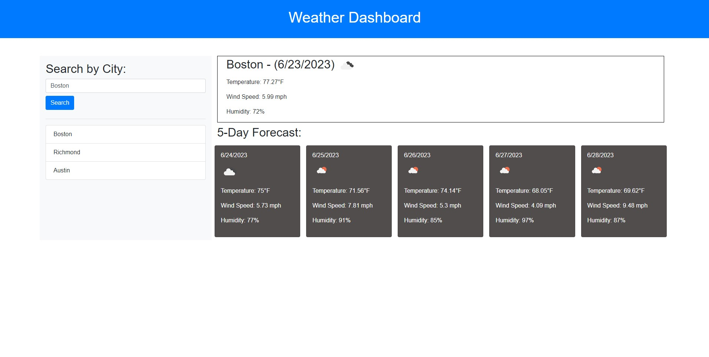

# Weather Dashboard

This is a simple weather dashboard application that allows users to search for weather information for different cities. The application displays the current weather for a selected city and provides a 5-day forecast. It will also display the current weather and 5-day forecast for your current location if your browser allows your location to be shared.

The site can be accessed [here](https://jonesmatr.github.io/Weather-Dashboard/).



## Table of Contents

- [Technologies Used](#technologies-used)
- [Features](#features)
- [Installation](#installation)
- [Usage](#usage)
- [Contributing](#contributing)
- [License](#license)

## Technologies Used

The following technologies were used to build this weather dashboard:

- HTML
- CSS
- Bootstrap 4.5.0
- JavaScript
- OpenWeather API

## Features

- Search for weather information by city name
- Display the current weather for the selected city, including temperature, wind speed, humidity, and weather description
- Display a 5-day forecast for the selected city, including date, weather icon, temperature, wind speed, humidity, and weather description
- Save search history and display it for quick access to previously searched cities

## Installation

To play the coding quiz challenge, follow these steps:

1. Clone the repository to your local machine using the following command:
```bash
git clone https://github.com/jonesmatr/Weather-Dashboard.git
``` 
2. Open the `index.html` file in a web browser.

## Usage

To use the weather dashboard, follow these steps:

1. Open the index.html file in a web browser.

2. Enter the name of a city in the "Search by City" input field.

3. Click the "Search" button to fetch the weather information for the specified city.

4. The current weather for the selected city will be displayed in the "Current Weather" section.

5. The 5-day forecast for the selected city will be displayed in the "5-Day Forecast" section.

6. To view the weather for a previously searched city, click on the city name in the search history list.